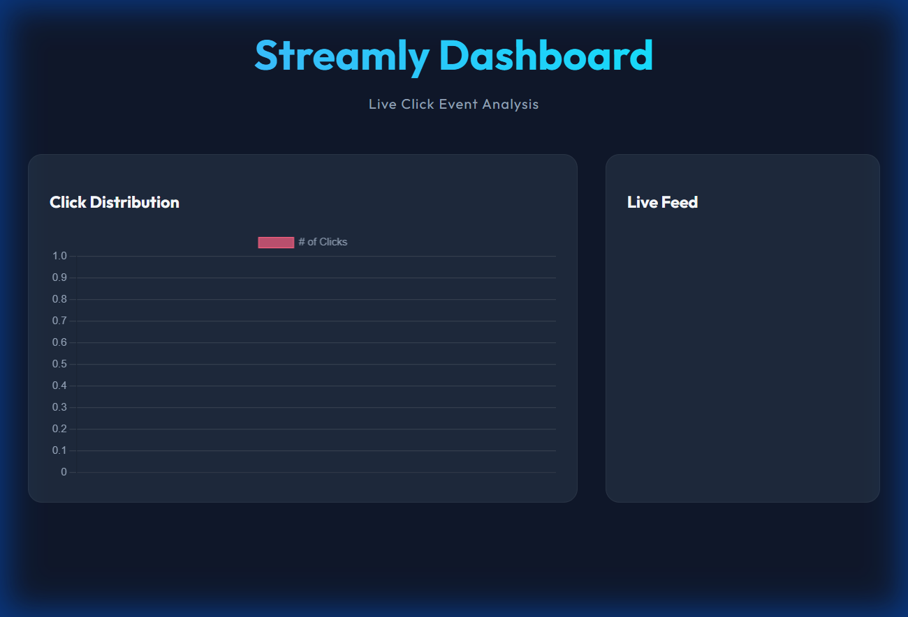

# Streamly - Kafka ClickStream Demo

## 🎯 What We Are Trying to Achieve

This project demonstrates a robust, real-time event streaming architecture designed to integrate legacy systems (like **Siebel**) with modern, event-driven dashboards using **Apache Kafka** and **Spring Boot**.

The goal is to solve the "Black Box" problem where user interactions in a backend system are lost. By streaming these events to Kafka, we enable:
1.  **Real-Time Analytics**: Visualize user behavior instantly.
2.  **Decoupling**: The backend (Producer) doesn't care who consumes the data.
3.  **Scalability**: Kafka handles millions of events without crashing the main application.

In this demo, we simulate a "Clickbait" news site. Every time a user clicks a card, the event is:
1.  Captured by the **Frontend**.
2.  Sent to the **Spring Boot Backend**.
3.  Published to a **Kafka Topic** (`clickbait-events`).
4.  Consumed immediately and broadcast via **WebSockets** to update the **Live Dashboard**.

---

## 📸 Screenshots

Here is a view of the application dashboard from a live run.



---

## 🚀 Build & Run

Follow these steps to build and run the application locally.

### Prerequisites
*   **Java 17** or higher
*   **Apache Maven** 3.x
*   **Apache Kafka** (Zookeeper & Broker must be running)

### Step 1: Start Kafka
Ensure your local Kafka instance is up.
```powershell
# Term 1: Zookeeper
.\bin\windows\zookeeper-server-start.bat .\config\zookeeper.properties

# Term 2: Broker
.\bin\windows\kafka-server-start.bat .\config\server.properties
```

### Step 2: Build the Application
Navigate to the project root and run the Maven build.

```bash
mvn clean install
```

**Example Build Output:**
```text
[INFO] Scanning for projects...
[INFO] 
[INFO] -----------------< com.example:clickbait-kafka-demo >-----------------
[INFO] Building clickbait-kafka-demo 0.0.1-SNAPSHOT
[INFO] --------------------------------[ jar ]---------------------------------
...
[INFO] --- maven-surefire-plugin:2.22.2:test (default-test) @ clickbait-kafka-demo ---
[INFO] Tests are skipped.
[INFO] 
[INFO] --- maven-jar-plugin:3.2.0:jar (default-jar) @ clickbait-kafka-demo ---
[INFO] Building jar: D:\Kafka-ClickBait\target\clickbait-kafka-demo-0.0.1-SNAPSHOT.jar
[INFO] ------------------------------------------------------------------------
[INFO] BUILD SUCCESS
[INFO] ------------------------------------------------------------------------
[INFO] Total time:  4.238 s
[INFO] Finished at: 2024-12-29T14:30:00+05:30
[INFO] ------------------------------------------------------------------------
```

### Step 3: Run the Application
You can run it directly with Maven or using the generated JAR.

```bash
mvn spring-boot:run
```

**Example Startup Logs:**
```text
  .   ____          _            __ _ _
 /\\ / ___'_ __ _ _(_)_ __  __ _ \ \ \ \
( ( )\___ | '_ | '_| | '_ \/ _` | \ \ \ \
 \\/  ___)| |_)| | | | | || (_| |  ) ) ) )
  '  |____| .__|_| |_|_| |_\__, | / / / /
 =========|_|==============|___/=/_/_/_/
 :: Spring Boot ::                (v3.2.0)

2024-12-29 14:32:10.456  INFO 18452 --- [main] c.e.c.ClickbaitApplication    : Starting ClickbaitApplication using Java 17...
2024-12-29 14:32:11.890  INFO 18452 --- [main] o.a.k.clients.admin.AdminClientConfig : AdminClientConfig values: 
2024-12-29 14:32:12.123  INFO 18452 --- [main] o.s.b.w.embedded.tomcat.TomcatWebServer : Tomcat started on port(s): 8080 (http)
2024-12-29 14:32:12.150  INFO 18452 --- [main] c.e.c.ClickbaitApplication    : Started ClickbaitApplication in 2.15 seconds
```

### Step 4: Verify
Open your browser to:
*   **Producer**: [http://localhost:8080](http://localhost:8080)
*   **Consumer (Dashboard)**: [http://localhost:8080/dashboard.html](http://localhost:8080/dashboard.html)
